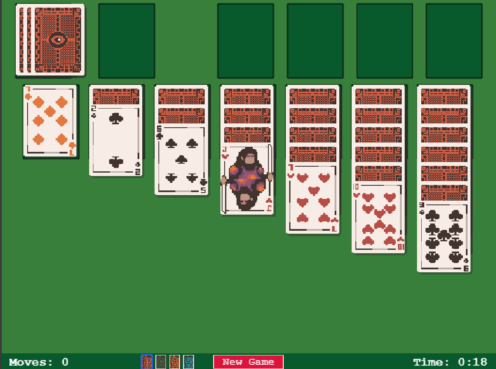

# Solitaire

Classic Klondike Solitaire built with Phaser 3 and TypeScript.



## Features

- **Drag & drop gameplay** - Move cards between tableau, foundation, and discard piles
- **Card back customization** - Choose from 4 different card back designs (persists across sessions)
- **Timer & move counter** - Track your progress
- **Win animation** - Cascading card celebration when you complete the game
- **Auto-fit scaling** - Adapts to different screen sizes
- **Clean UI** - Minimalist design with clear visual feedback

## Tech Stack

- [Phaser 3.90.0](https://github.com/phaserjs/phaser) - Game framework
- [TypeScript 5.7.2](https://github.com/microsoft/TypeScript) - Type-safe code
- [Vite 6.3.1](https://github.com/vitejs/vite) - Fast dev server & build tool

## Quick Start

```bash
npm install
npm run dev
```

Open http://localhost:8080 to play.

## Build for Production

```bash
npm run build
```

Output will be in the `dist` folder.

## Project Structure

```
src/
  game/
    scenes/      # Boot, Preload, Title, Game, WinPopup
    lib/         # Card, Deck, Solitaire logic
public/
  assets/        # Card sprites and images
```

## License

MIT

To deploy your game, upload the entire contents of the `dist` folder to a web server.

## License

This project is licensed under the MIT License - see the LICENSE file for details.
